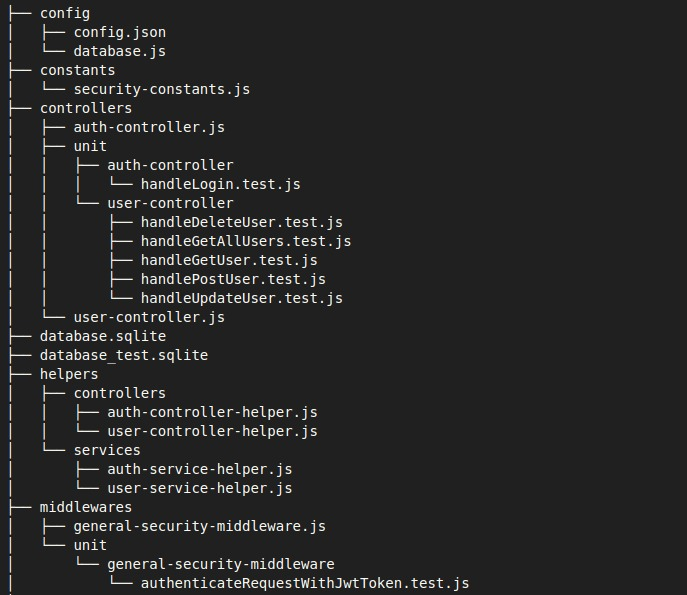
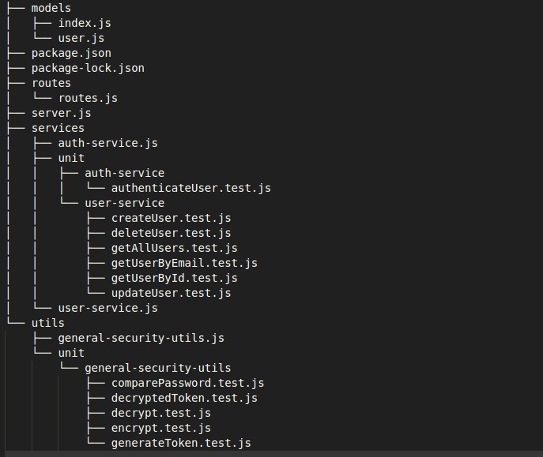
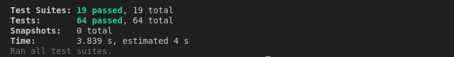
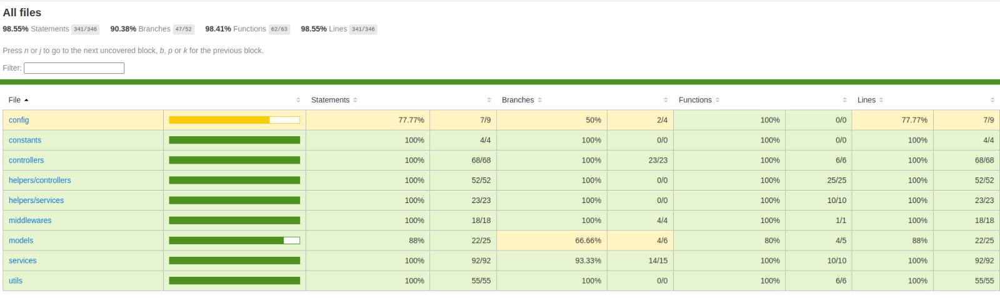
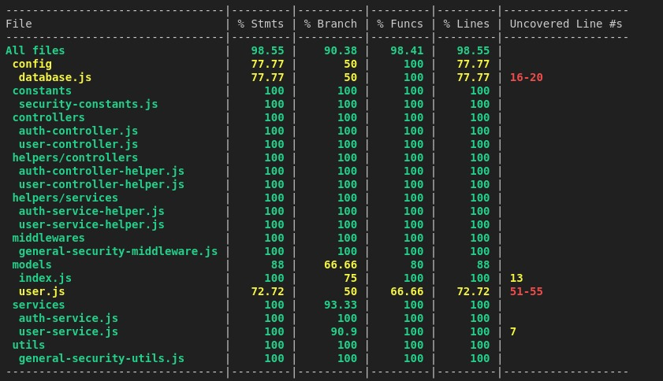

# Controle de Usuário API

## Descrição

A projeto em questão é uma API que realiza o controle de usuários, permitindo as operações de criar, ler por email ou id, atualizar e deletar. Além disso, foi implementado autenticação e autorização utilizando token JWT.

## Requisitos

- Node.js: [Instalação do Node.js](https://docs.npmjs.com/downloading-and-installing-node-js-and-npm)

## Como baixar

1. Clone este repositório utilizando o comando:
   ```bash
   git clone https://github.com/seu-usuario/seu-repositorio.git


## Estrutura do Código:





Obs.: Cada arquivo de teste (*.test.js) representa uma função na classe indicada na pasta de mesmo nome da classe, exemplo `unit>general-security-utils` contém os testes de todos os métodos do arquivo `general-security-utils.js`.

## Executando os Testes Unitários:

Deve ser executado no terminal dentro do diretório em que o projeto se encontra, os seguintes comandos:

1. `npm install`
2. `npm run test`

Ao finalizar, o resultado esperado deve ser:


## Métricas de Cobertura de Teste:

Deve ser executado no terminal dentro do diretório em que o projeto se encontra, os seguintes comandos:

1. `npm install`
2. `npm run test:coverage`

Obs.: ao finalizar a execução deve ser aberta uma página na web com os detalhes.

Caso não abra automaticamente, siga para o arquivo especificado no diretório: coverage/lcov-report/index.html e abra com o Google Chrome:



Obs.: Pode ser feita a navegação entre as classes, as partes de código sem cobertura, estarão com destaque em vermelho.


Caso seja preferivel, também é possive visualizar diretamente no terminal:




